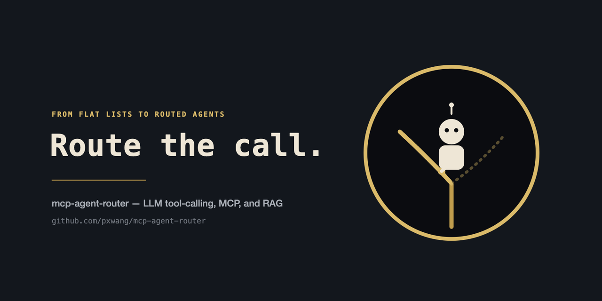
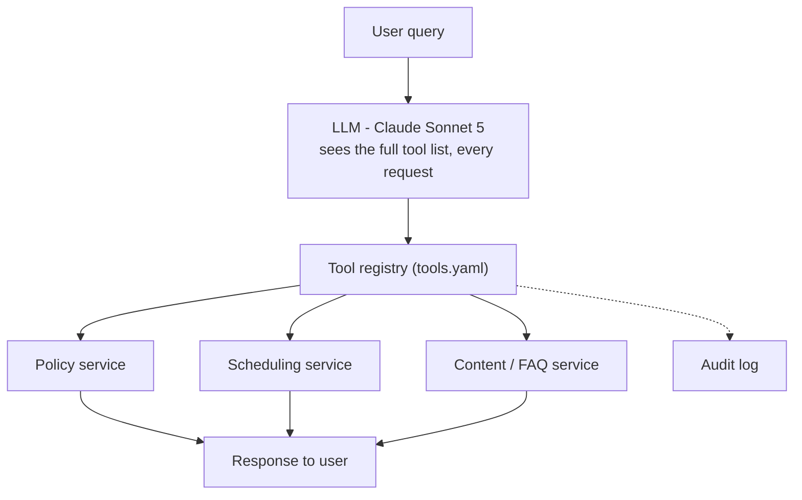
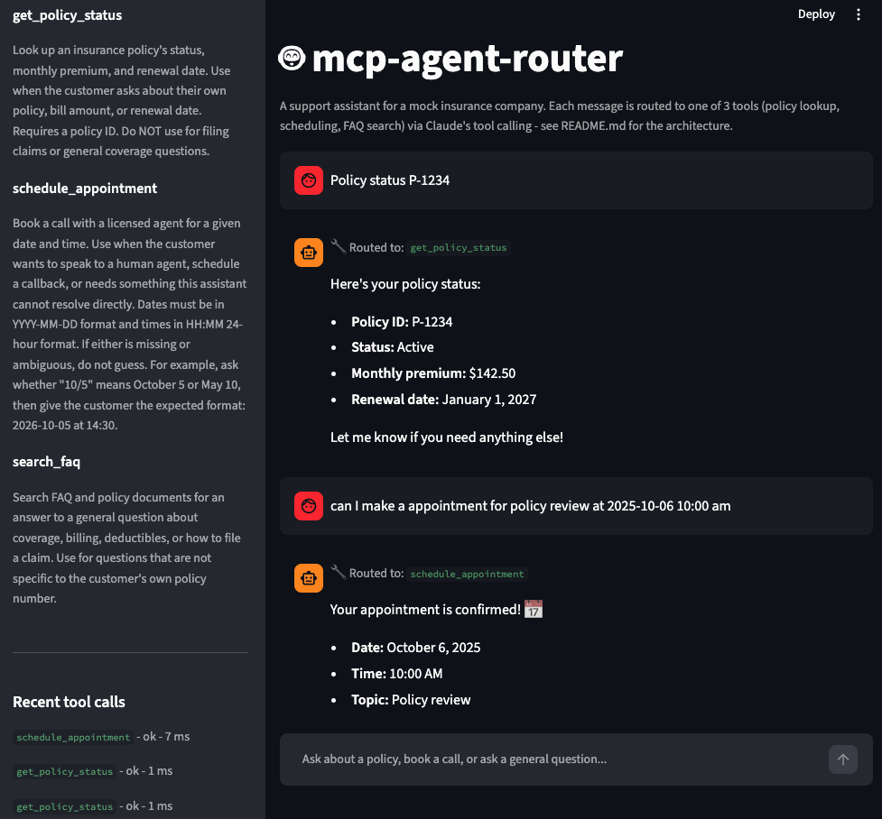
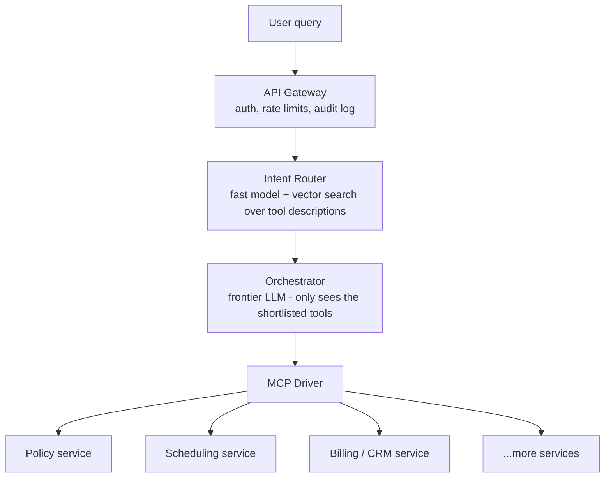

# mcp-agent-router

An AI chat agent that routes requests to domain services via LLM tool calling, MCP servers, and RAG. See [PROJECT_PLAN.md](PROJECT_PLAN.md) for the full design and build plan.

## Status

**Step 1 of the build plan:** a text-only tool-calling agent with 3 mock tools
(`get_policy_status`, `schedule_appointment`, `search_faq`) backed by SQLite.
Tools are defined in a config-driven registry (`src/mcp_agent_router/config/tools.yaml`)
rather than hardcoded, so the next step (moving them behind MCP servers) is a drop-in change.



All three are real services conceptually; today's POC mocks all three behind one SQLite file
for development convenience, not as the intended production design.

## Setup

```bash
python -m venv .venv && source .venv/bin/activate
pip install -e ".[dev]"
export ANTHROPIC_API_KEY=sk-ant-...
```

Each new terminal session needs `source .venv/bin/activate` again before running anything below -
otherwise `streamlit`, `pytest`, etc. may resolve to a different Python (e.g. Anaconda's) that
doesn't have this project installed, and you'll see `ModuleNotFoundError: No module named
'mcp_agent_router'`. If that happens, either activate the venv or call its binaries directly
(`.venv/bin/streamlit`, `.venv/bin/pytest`, ...).

## Run

```bash
mcp-agent-router
# or: python -m mcp_agent_router.cli
```

```
% mcp-agent-router
mcp-agent-router (type 'exit' to quit)
you> what is status policy P-1234
agent> Here's the status for policy **P-1234**:

- **Status:** Active
- **Monthly premium:** $142.50
- **Renewal date:** January 1, 2027

Let me know if you need anything else!
you> Can I book a call next Tuesday at 2pm?
agent> I'd be happy to help! Could you confirm the exact date for "next Tuesday" (in YYYY-MM-DD format)? Also, just to confirm — 2pm would be 14:00. What topic should I note for the call?
you> 2016-10-6 at 14:00
agent> Just to double check — 2016-10-06 would be a date in the past (and it falls on a Thursday, not a Tuesday). Did you mean **2026-10-06**? Please confirm the correct year, and let me know what topic the call should cover.
you> oh 2026-10-06 at 14:00
agent> Got it! Just need one more thing — what topic should I note for this call (e.g., billing question, claims, policy review)?
you> policy review
agent> Your call is booked for **October 6, 2026 at 2:00 PM** to discuss a **policy review**. You'll hear from an agent then — let me know if you need anything else!
you> What's aduductible?
agent> A **deductible** is the amount you pay out of pocket on a claim before your insurance coverage kicks in to pay the rest. Let me know if you'd like more details!
you> exit
```

This is a real, unedited session. A few things worth noticing: the agent handles a casual phrasing and a typo without trouble, and when asked to book an appointment it holds off on calling `schedule_appointment` until it has a valid date, time, and topic - it even catches an ambiguous/implausible year ("2016" isn't a Tuesday) rather than silently booking the wrong date. That clarify-before-acting behavior comes from the system prompt's guardrail ("never guess personal data... ask a clarifying question"), not from any special-casing in the tool itself.

(Note: the agent writes markdown - `**bold**`, bullets - which the terminal above shows as raw asterisks. The Streamlit UI below renders it properly.)

## UI

A simple Streamlit chat interface, same agent and tools, with markdown rendering and a
sidebar showing the tool registry and recent audit log entries:

```bash
streamlit run app.py
# or, without activating the venv: .venv/bin/streamlit run app.py
```



## Test

```bash
pytest
```

Tests cover the tool executors and the registry; they don't call the Anthropic API.

## Routing evals

```bash
python evals/run_routing_evals.py
```

Replays `evals/routing_evals.jsonl` through the agent and checks whether each utterance
triggered the expected tool(s) - currently 7/7. This calls the Anthropic API once per
case, so it's a manual check, not wired into CI or any pre-commit/pre-push hook - running
it on every check-in would add API cost for no benefit at this project's size.

## MCP example: wrapping an existing REST service

A self-contained simulation of step 2 of the build plan: a team already has a REST API
(`services/policy_service.py` - plain FastAPI, no AI involved), and `mcp_servers/policy_mcp_server.py`
is a thin MCP server bolted on top of it, unmodified - each tool call is just an HTTP
request to one existing endpoint. `mcp_servers/demo_client.py` is a plain MCP client (no
Claude, no LLM) that discovers and calls the tool, proving the loop works on its own -
this is exactly what an LLM's tool-calling runtime does under the hood.

```bash
pip install -e ".[mcp-demo]"

# terminal 1
uvicorn services.policy_service:app --port 8800

# terminal 2
python mcp_servers/policy_mcp_server.py

# terminal 3
python mcp_servers/demo_client.py
```

```
Discovered tools: ['get_policy_status']
get_policy_status(P-1234) -> [TextContent(..., text='{\n  "policy_id": "P-1234",\n  "status": "active", ...}')]
get_policy_status(P-0000) -> [TextContent(..., text='{\n  "error": "Policy P-0000 not found"\n}')]
```

### Wiring it into the live agent

`demo_client.py` above is a standalone proof that the MCP loop works - the chat agent itself
still calls `get_policy_status` locally via `tools.py`/`executors.py` by default, and the full
test suite, CLI, and Streamlit UI all run with zero extra servers, exactly as before.

`get_policy_status` can be switched to the real MCP server instead, opt-in, by setting one
env var - `schedule_appointment` and `search_faq` stay local either way:

```bash
# with both servers above still running
MCP_AGENT_ROUTER_POLICY_BACKEND=mcp mcp-agent-router
```

`ToolRegistry.call()` (`tools.py`) checks that flag only for `get_policy_status` and, when set,
calls `mcp_client.py`'s sync wrapper around a real MCP `ClientSession` instead of the local
SQLite-backed function - everything upstream (the orchestrator loop, the audit log, the tool's
name/description/schema shown to Claude) is unchanged, because from the agent's point of view
it's still just "a tool that returns a dict." If the MCP server isn't reachable, it returns
`{"error": "..."}` rather than crashing. The `mcp` package itself is only imported when this
path actually runs, so it stays an optional dependency (`pip install -e ".[mcp-demo]"`) rather
than a requirement for the default local-only setup.

## Layout

```
app.py                     # Streamlit chat UI
src/mcp_agent_router/
  config/tools.yaml   # tool registry: name, description, domain, owner, schema, permissions
  db.py               # SQLite mock data (policies, appointments, faq_entries)
  executors.py        # tool implementations
  tools.py            # loads tools.yaml -> LLM tool list + executor dispatch
  mcp_client.py        # opt-in: sync wrapper to call get_policy_status over real MCP
  agent.py            # tool-calling loop (Anthropic Messages API)
  audit.py            # per-call audit log (query, tool, latency, outcome)
  cli.py              # interactive REPL
evals/
  routing_evals.jsonl      # utterance -> expected tool(s)
  run_routing_evals.py     # replays each case through the agent, reports pass/fail
services/
  policy_service.py        # plain REST API - the "existing" system, no AI
mcp_servers/
  policy_mcp_server.py      # MCP server wrapping policy_service.py
  demo_client.py             # plain MCP client proving the loop end-to-end
```

## Future thoughts: scaling past a handful of tools

The current design - one LLM call sees the full tool list - is simple, cheap, and the right
fit under roughly 10-15 tools. Past that point, prompt bloat starts raising cost and latency
and lowering routing precision. A few options, roughly in order of effort, for if/when that
threshold is crossed:

- **Group tools by domain.** Split the flat list into domain buckets (policy, billing,
  scheduling, ...) and have the LLM pick a domain first, then see only that domain's tools.
  No new infrastructure, just a restructured registry and prompt.
- **Add a fast classifier in front, with a confidence fallback.** A cheap keyword or
  embedding-based classifier narrows the domain before the LLM runs; below a confidence
  threshold, ask a clarifying question instead of guessing.
- **A full layered gateway**, once the tool count genuinely grows large: a vector search over
  tool descriptions shortlists the 3-5 most relevant tools, a small/fast model picks among
  them, and only then does the frontier-model orchestrator see any tool schema - keeping its
  prompt small no matter how many services exist. An MCP driver dispatches the resulting call
  to the right service(s), in parallel when a request needs more than one.



**The orchestrator isn't a new component - it's today's POC, fed a shorter list.** The intent
router only classifies: which domain, or which 3-5 tools are plausible candidates. It never
decides, extracts a parameter, or writes a response. The orchestrator is where the actual
decision happens, and it's the same mechanism as the current `agent.py` loop - same model
(Claude Sonnet 5), same tool-calling code path. The only thing that changes is which list of
tools it's handed: today, every tool; under this design, whatever the router shortlisted for
that request. `agent.py` doesn't need to change to adopt this - it already takes a list of
tools as input and doesn't care how that list was produced. All the new engineering is in the
router sitting in front of it, not in rebuilding the part that already works.

Other things worth keeping in mind as this grows:

- Keep tool schemas in a provider-agnostic registry (`tools.yaml` already does this) so the
  orchestrator model, or even its cloud provider, can be swapped without rewriting routing logic.
- Evaluate existing MCP/LLM gateway products before building a custom layered gateway -
  build only what doesn't already exist in a form that fits.
- Gate any routing change behind the routing-eval set (accuracy, latency) against the current
  baseline before rolling it out further - this architecture should be adopted once the
  evidence says it's needed, not ahead of it.
